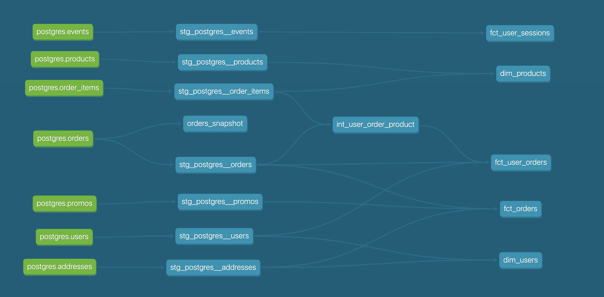

## What is the repeat rate for Greenery?

Answer is 79.8%.

Query to check that:

```sql
select 
    sum(is_frequent_buyer::int) / sum(is_buyer::int) as answer
from dev_db.dbt_olegagapovpaltacom.fct_user_orders
```

## Which orders changed from week 1 to week 2?

Answer:

| order_id                             |
|--------------------------------------|
| 265f9aae-561a-4232-a78a-7052466e46b7 |
| e42ba9a9-986a-4f00-8dd2-5cf8462c74ea |
| b4eec587-6bca-4b2a-b3d3-ef2db72c4a4f |

Query to check that:

```sql
select *
from dev_db.dbt_olegagapovpaltacom.orders_snapshot
where dbt_valid_to is not null
```

## Week 2 models


