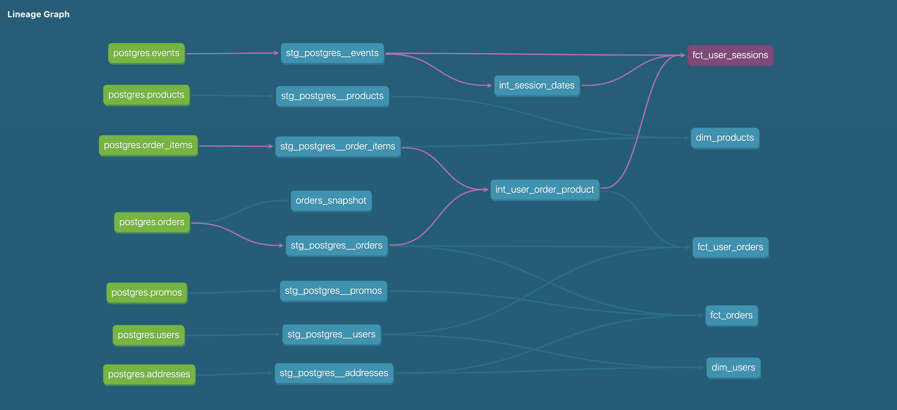

## What is our overall conversion rate?

Our overall conversion rate is 62.4%:

| Total sessions | Session with checkout | Conversion rate |
|----------------|-----------------------|-----------------|
| 578            | 361                   | 0.624567        |

Query:

```sql
select
    total_sessions,
    sessions_with_checkout,
    div0(sessions_with_checkout, total_sessions) as conversion_rate
from (
    select 
        count(distinct session_id) as total_sessions,
        count(distinct case when checkout > 0 then session_id end) as sessions_with_checkout
    from dev_db.dbt_olegagapovpaltacom.fct_user_sessions
)
```

## What is our conversion rate by product?

| PRODUCT_NAME        | TOTAL_SESSIONS | SESSIONS_WITH_CHECKOUT | CONVERSION_RATE |
|---------------------|----------------|------------------------|-----------------|
| Alocasia Polly      | 51             | 20                     | 39.22%          |
| Aloe Vera           | 65             | 28                     | 43.08%          |
| Angel Wings Begonia | 61             | 21                     | 34.43%          |
| Arrow Head          | 63             | 32                     | 50.79%          |
| Bamboo              | 67             | 34                     | 50.75%          |
| Bird of Paradise    | 60             | 25                     | 41.67%          |
| Birds Nest Fern     | 78             | 30                     | 38.46%          |
| Boston Fern         | 63             | 23                     | 36.51%          |
| Cactus              | 55             | 29                     | 52.73%          |
| Calathea Makoyana   | 53             | 26                     | 49.06%          |
| Devil's Ivy         | 45             | 20                     | 44.44%          |
| Dragon Tree         | 62             | 29                     | 46.77%          |
| Ficus               | 68             | 27                     | 39.71%          |
| Fiddle Leaf Fig     | 56             | 26                     | 46.43%          |
| Jade Plant          | 46             | 20                     | 43.48%          |
| Majesty Palm        | 67             | 29                     | 43.28%          |
| Money Tree          | 56             | 25                     | 44.64%          |
| Monstera            | 49             | 23                     | 46.94%          |
| Orchid              | 75             | 33                     | 44.00%          |
| Peace Lily          | 66             | 24                     | 36.36%          |
| Philodendron        | 62             | 25                     | 40.32%          |
| Pilea Peperomioides | 59             | 25                     | 42.37%          |
| Pink Anthurium      | 74             | 29                     | 39.19%          |
| Ponytail Palm       | 70             | 28                     | 40.00%          |
| Pothos              | 61             | 20                     | 32.79%          |
| Rubber Plant        | 54             | 27                     | 50.00%          |
| Snake Plant         | 73             | 24                     | 32.88%          |
| Spider Plant        | 59             | 23                     | 38.98%          |
| String of pearls    | 64             | 38                     | 59.38%          |
| ZZ Plant            | 63             | 31                     | 49.21%          |


Query:

```sql
select
    p.product_name,
    c.total_sessions,
    c.sessions_with_checkout,
    round(div0(c.sessions_with_checkout, c.total_sessions)*100, 2) || '%' as conversion_rate
from (
    select 
        product_id,
        count(distinct session_id) as total_sessions,
        count(distinct case when package_shipped > 0 then session_id end) as sessions_with_checkout
    from dev_db.dbt_olegagapovpaltacom.fct_user_sessions
    group by 1
) c
left join dev_db.dbt_olegagapovpaltacom.dim_products p
    on p.product_id = c.product_id
order by product_name
```

## Which orders changed from week 2 to week 3? 

| ORDER_ID                             |
|--------------------------------------|
| 265f9aae-561a-4232-a78a-7052466e46b7 |
| e42ba9a9-986a-4f00-8dd2-5cf8462c74ea |
| b4eec587-6bca-4b2a-b3d3-ef2db72c4a4f |

Query:

```sql
select order_id
from dev_db.dbt_olegagapovpaltacom.orders_snapshot
where dbt_valid_to < '2023-01-28' -- date when new snapchot was generated
```

## dbt DAG changes

- added new intermediate model `int_session_dates` that contains start and end dates for each `session_id`
- added product_id split to `f_user_session` model


