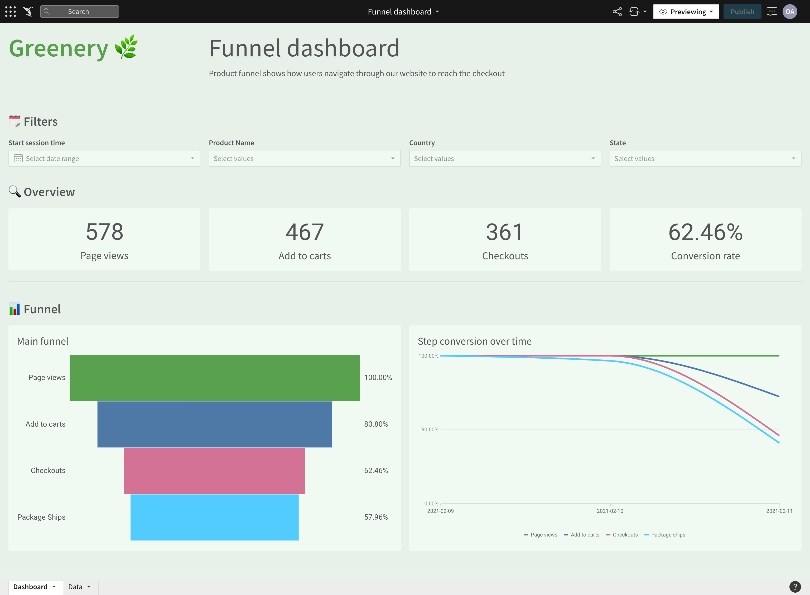

# Which orders changed from week 3 to week 4?

Three orders changed their statuses:

| ORDER_ID                             |
|--------------------------------------|
| 0e9b8ee9-ad0a-42f4-a778-e1dd3e6f6c51 |
| 841074bf-571a-43a6-963c-ba7cbdb26c85 |
| df91aa85-bfc7-4c31-93ef-4cee8d00a343 |

SQL:

```sql
select * 
from dev_db.dbt_olegagapovpaltacom.orders_snapshot
where dbt_updated_at::date = '2023-02-01'
```

# Product funnel

Product funnel is defined with 3 levels:

- Sessions with any event of type page_view
- Sessions with any event of type add_to_cart
- Sessions with any event of type checkout

Three questions to answer:

- How are our users moving through the product funnel?
- Which steps in the funnel have largest drop off points?
- How Product and Engineering teams are improving these metrics on an ongoing basis (over time)?

To address all the questions (ans some more) I've built a [dashboard in Sigma](https://app.sigmacomputing.com/corise-dbt/workbook/workbook-5upaWGEVNvsueM88Db29OS):



A few notable improvements over the original request:
- added filters for session start time (to be able to see funnel for different timeframes)
- added product filter
- added coutnry and state filtes
- added additional step Package Shipped
- added graph with funnel step conversions over time

Now we are able to answer the questions!

#### How are our users moving through the product funnel?

80.8% of our users add something to their carts. 62.5% of users actually purchase something. About 58% (out of 62.5%) already got their packages!

#### Which steps in the funnel have largest drop off points?

We can target both add to cart and checkout steps as the are both equally drop throught the funnel.

#### How Product and Engineering teams are improving these metrics on an ongoing basis (over time)?

Checking funnel conversions over time should definitely help to track that.

# dbt next steps for you

> What are 1-2 things you might do differently / recommend to your organization based on learning from this course?

I would definitely focus on two things:

1. Refactor our models and folders structure. This may benefit in a lot of way: more clear models, better re-usability, probably better visibility of available models.
2. Testing. Having such wide variety of options with dbt tests (generic tests, freshness, dbt_expectations) we could definitely elevate our QA process

# Setting up for production / scheduled dbt run of your project

This will definitely depend on a team size:

- for smaller teams I'd pick dbt Cloud as faster and easiest way to set up everything
- for larger team I'd go with Airflow or Prefect/Dagster
